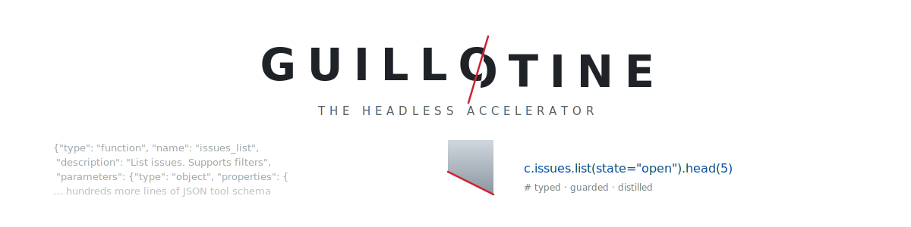

<p align="center">
  <picture>
    <source media="(prefers-color-scheme: dark)" srcset="assets/banner-dark.svg">
    
  </picture>
</p>

<p align="center">
  <a href="https://github.com/crmapj/guillotine/actions/workflows/ci.yml"></a>
  <a href="https://pypi.org/project/guillotine-gen/"></a>
  <a href="https://pypi.org/project/guillotine-gen/"></a>
  <a href="LICENSE"></a>
</p>

> **The headless accelerator.** Guillotine turns an OpenAPI definition into a compact,
> typed Python DSL that agents write code against, plus a matching skill pack and a
> single-tool code-mode MCP wrapper.

Guillotine is built around one invariant:

> **One spec -> one Curated Core IR -> N consistent projections.**

The generated DSL, skills, and MCP wrapper all come from the same intermediate
representation, so the runtime surface and the documentation surface cannot drift.

## What Works Today

Phase 0 is implemented as a working MVP:

- OpenAPI 3 YAML/JSON ingest.
- Curated Core IR for resources, operations, parameters, enum choices, request bodies,
  servers, and safety tiers.
- Generated Python DSL package with:
  - `connect(...) -> Client`
  - verb-first namespaces, for example `c.repos.get(owner, repo).one()`
  - `.raw` escape hatch on the client and namespaces
  - lazy `OperationResult` handles with `.run()`, `.head(n)`, `.one()`, `.json()`,
    `.all(max_pages=...)`, `.text()`, and `.grain()`
  - enum guards that fail before the API call
  - generated pagination helpers for common `page`/`per_page` and `offset`/`limit`
    query shapes
  - destructive-operation speed bumps through `yes=True`
  - generated `cheatsheet(section=..., grep=...)`, `help(...)`, and `help_json(...)`
- Generated portable Agent Skills pack.
- Generated MCP wrapper with one `exec` tool.
- Local subprocess runtime contract used by the MCP wrapper.
- `guillotine inspect` for compiler-surface reports and token-footprint estimates.
- Tests for ingest, code emission, generated UX, safety guards, CLI output, and runtime
  result capture.

The Landmine Loop, LLM-assisted ergonomic verb authoring, benchmark harness, SDK
reflection input, and hardened hosted sandbox are intentionally next-phase work. See
[`FOUNDATION.md`](FOUNDATION.md) for the full architecture and research base.

## Install

From PyPI, once the first release is published:

```bash
python3 -m pip install guillotine-gen
```

From a local checkout:

```bash
uv venv
uv pip install -e ".[dev]"
```

Or with plain pip:

```bash
python3 -m pip install -e ".[dev]"
```

## Generate A DSL

```bash
guillotine build openapi.yaml -o ./out
```

Output:

```text
out/<package>/      generated Python DSL package
out/skills/         generated Agent Skills pack
out/mcp/            single-tool MCP wrapper
```

You can override the package name:

```bash
guillotine build openapi.yaml -o ./out --package-name github_api
```

## Use A Generated DSL

```python
import github_api

c = github_api.connect()  # uses the OpenAPI server default, env, or explicit args
repo = c.repos.get("octocat", "Hello-World").one()
print(repo["full_name"])

print(github_api.cheatsheet(section="repos", grep="list"))
print(github_api.help_json("repos.get"))
```

Use `.all()` for generated paginated operations:

```python
branches = c.repos.list_branches("octocat", "Hello-World").all(
    max_pages=3,
    per_page=50,
)
```

For authenticated APIs:

```python
c = github_api.connect(base_url="https://api.github.com", token="...")
```

`token=` is mapped to the first supported OpenAPI security scheme: bearer auth,
basic auth, or an `apiKey` header/query/cookie. For unusual auth flows, pass explicit
`headers=` or use `.raw`.

Generated auth environment variables follow the package name:

```bash
export GITHUB_API_BASE_URL=https://api.github.com
export GITHUB_API_TOKEN=...
```

`API_BASE_URL` and `API_TOKEN` are also accepted as generic fallbacks.

## Real OpenAPI Smoke

This repo has been smoke-tested against GitHub's public REST OpenAPI description:

- Input: GitHub REST OpenAPI JSON, 12.6 MB.
- Output: 47 DSL namespaces, generated skills, and MCP wrapper.
- Live call verified:

```python
import github_api
c = github_api.connect()
c.repos.get("octocat", "Hello-World").one()
```

Regenerate the example locally with:

```bash
curl -L https://raw.githubusercontent.com/github/rest-api-description/main/descriptions/api.github.com/api.github.com.json \
  -o /tmp/github.openapi.json
guillotine build /tmp/github.openapi.json -o examples/generated/github --package-name github_api
```

`examples/generated/` is ignored by git so the repository stays small; it is a
reproducible smoke artifact, not hand-maintained source.

## MCP Security Note

The generated MCP wrapper is a proof-of-concept code-mode surface. The local executor
is **not a sandbox** — agent code runs with the full privileges of the server process —
so the `exec` tool is disabled until you opt in with `GUILLOTINE_ALLOW_EXEC=1`, and only
in a trusted, isolated environment. It also does not accept API tokens as tool arguments
because the executor cannot hide secrets from arbitrary Python code. Use it for
public/read-only APIs, or replace the executor with a hardened supervisor before
exposing authenticated secrets.

## Docs

- [Quickstart](docs/quickstart.md)
- [Generated DSL contract](docs/generated-dsl-contract.md)
- [Security model](docs/security-model.md)
- [Release checklist](docs/release.md)
- [OSS readiness notes](docs/oss-readiness.md)
- [Roadmap](ROADMAP.md)

## Test

```bash
python3 -m pytest -q
guillotine build tests/fixtures/todo_openapi.yaml -o /tmp/guillotine-smoke
python3 -m compileall -q /tmp/guillotine-smoke/acme_tasks /tmp/guillotine-smoke/mcp
```

With dev dependencies:

```bash
ruff check .
```

## CLI

```bash
guillotine --help
guillotine build --help
guillotine inspect openapi.yaml --format markdown
```

`inspect` reports resources, operations, safety tiers, enum guards, and generated
pagination coverage. Its footprint number is a rough, static estimate (chars/4)
comparing the equivalent JSON tool schemas to the generated cheatsheet surface — a
discovery-layer proxy, not a benchmark, and it excludes the runtime
distillation/code-mode wins.

## Project Layout

```text
src/guillotine/
  ingest/       OpenAPI loaders
  ir/           Curated Core IR
  emit/         Python DSL, skills, MCP projections
  runtime/      Local code executor contract
tests/          Unit and generated-code UX tests
examples/       Generated real-spec smoke artifacts
```

## Community

- [Contributing](CONTRIBUTING.md)
- [Code of Conduct](CODE_OF_CONDUCT.md)
- [Security](SECURITY.md)
- [Support](SUPPORT.md)
- [Changelog](CHANGELOG.md)

## License

Apache-2.0.
